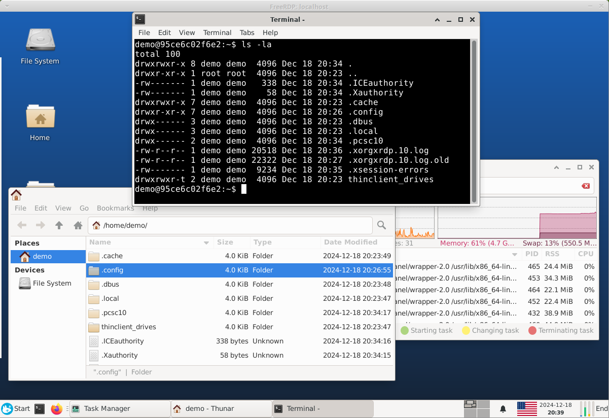

# ubuntu-docker-desktop-xrdp

Trying to add audio to a browser for my project [Browsers-NoVNC](https://github.com/gitxpresso/browsers-novnc)

The Docker image size is less than 970 MB, including the Firefox web browser.

## Software Requirements

To install Docker Engine (CE), follow the instructions on the official [website](https://docs.docker.com/engine/install/).

## Build docker image, run container and open RDP client:

All necessary instructions are prepared by functions of the [init.sh](init.sh) bash script.

```bash
. init.sh # Load bash functions
dbuild    # Build docker image
drun      # Run container
dxrdp     # Open xfreerdp desktop client
dstop     # Stop the container (and remove it)
```

To log in, use the following default user account details:

```bash
Username: demo
Password: changeit
```

## Screenshot of login prompt of `xfreerdp` application


## Screenshot of XFCE desktop



